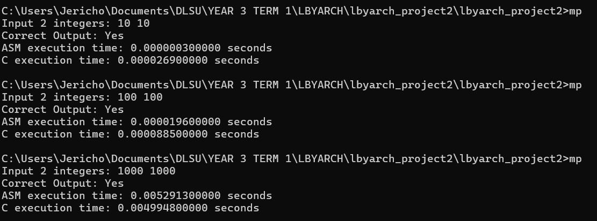

# LBYARCH MP2
Balajadia, John Ryan  
Reyes, Jericho Migell  

# Specifications
Mapping from uint8 based integer grayscale to double precision float
 # Results
| Row | 10 $\times$ 10 ASM | 10 $\times$ 10 C | 100 $\times$ 100 ASM | 100 $\times$ 100 C | 100 $\times$ 100 ASM | 100 $\times$ 100 C |
| :-: | :-----: | :-----: | :------: | :-----: | :-----: | :-----: |
| 1   | 0.0000012   | 0.000016    | 0.000022    | 0.000091    | 0.005039    | 0.0045234   |
| 2   | 0.0000006   | 0.0000117   | 0.0000236   | 0.0000924   | 0.0052217   | 0.0043354   |
| 3   | 0.0000004   | 0.0000312   | 0.0000209   | 0.0001028   | 0.0052221   | 0.0046934   |
| 4   | 0.0000004   | 0.0000247   | 0.0000165   | 0.0000824   | 0.005183    | 0.004824    |
| 5   | 0.0000004   | 0.0000291   | 0.000015    | 0.0000749   | 0.0051491   | 0.0048927   |
| 6   | 0.0000008   | 0.0000135   | 0.0000236   | 0.0000768   | 0.005451    | 0.0046838   |
| 7   | 0.0000003   | 0.0000114   | 0.0000167   | 0.0000778   | 0.0051164   | 0.0047531   |
| 8   | 0.0000004   | 0.0000262   | 0.0000148   | 0.0000821   | 0.0052877   | 0.004707    |
| 9   | 0.0000003   | 0.000015    | 0.0000148   | 0.000075    | 0.0050665   | 0.0046393   |
| 10  | 0.0000003   | 0.0000262   | 0.0000186   | 0.0000995   | 0.0051487   | 0.0046248   |
| 11  | 0.0000003   | 0.0000119   | 0.0000189   | 0.0000834   | 0.0052257   | 0.0046432   |
| 12  | 0.0000004   | 0.0000231   | 0.0000182   | 0.0000831   | 0.0053652   | 0.0048546   |
| 13  | 0.0000003   | 0.0000121   | 0.0000184   | 0.0000785   | 0.0050944   | 0.0045415   |
| 14  | 0.0000003   | 0.0000107   | 0.0000184   | 0.0000947   | 0.0054078   | 0.0044061   |
| 15  | 0.0000005   | 0.000027    | 0.0000144   | 0.0000864   | 0.0054277   | 0.0048209   |
| 16  | 0.0000003   | 0.0000126   | 0.0000186   | 0.0000945   | 0.0052481   | 0.0045888   |
| 17  | 0.0000003   | 0.0000138   | 0.0000183   | 0.0000936   | 0.0052      | 0.0043712   |
| 18  | 0.0000004   | 0.0000111   | 0.0000228   | 0.0000228   | 0.0051501   | 0.0048649   |
| 19  | 0.0000003   | 0.0000117   | 0.0000182   | 0.000083    | 0.0050898   | 0.0045823   |
| 20  | 0.0000003   | 0.0000259   | 0.0000237   | 0.0000919   | 0.0056844   | 0.0046168   |
| 21  | 0.0000003   | 0.0000115   | 0.000015    | 0.0000821   | 0.0053931   | 0.0043563   |
| 22  | 0.0000004   | 0.0000216   | 0.0000267   | 0.000083    | 0.0051189   | 0.0046752   |
| 23  | 0.0000003   | 0.0000235   | 0.0000235   | 0.0000834   | 0.0051321   | 0.0045961   |
| 24  | 0.0000004   | 0.0000117   | 0.0000256   | 0.0000869   | 0.0055482   | 0.0047427   |
| 25  | 0.0000005   | 0.0000161   | 0.0000201   | 0.000089    | 0.0051004   | 0.0052121   |
| 26  | 0.0000003   | 0.0000224   | 0.0000216   | 0.0000983   | 0.0052157   | 0.0045763   |
| 27  | 0.0000003   | 0.0000158   | 0.0000207   | 0.0000906   | 0.0055785   | 0.0046893   |
| 28  | 0.0000003   | 0.0000239   | 0.0000149   | 0.0000827   | 0.0051793   | 0.004619    |
| 29  | 0.0000004   | 0.000021    | 0.0000186   | 0.000084    | 0.0051053   | 0.0047543   |
| 30  | 0.0000003   | 0.000018    | 0.0000242   | 0.0000925   | 0.0051112   | 0.0043928   |
| **AVG** | **0.0000004** | **0.0000183467** | **0.0000195767** | **0.0000846367** | **0.005242037** | **0.00465271** |

**Explanation**  
- For smaller results, Assembly is always faster due to its general speed, given that you're doing low level programming aka programming at a level close to the hardware.
- For bigger results however, given the numerous optimizations C has, and the fact that its also a lower level programming language compared to more mainstream ones, that compiles directly to assembly and thus results in more optimized assembly code no less, it makes sense that C can beat out assembly at times.
- In other words, good C code is better than most Assembly code.

# Demonstration

# Video Link
TBA